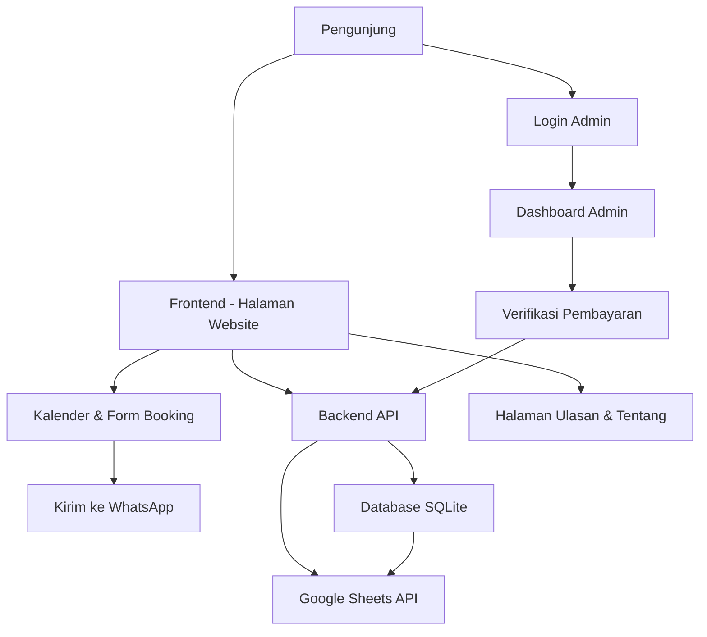
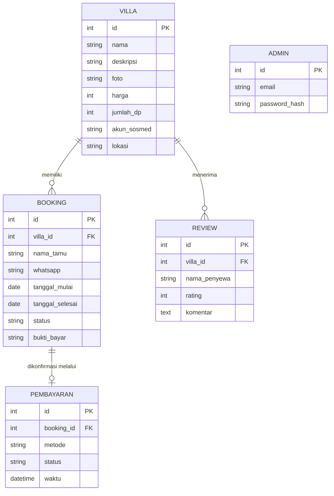
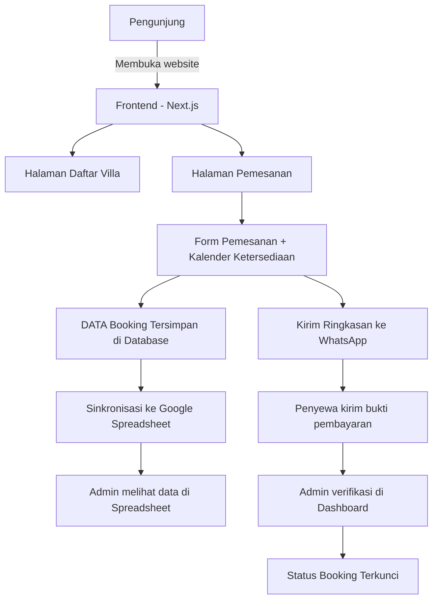

# PRD — Project Requirements Document

## 1. Overview
Website ini dibuat untuk mempermudah proses pemesanan villa secara online. Masalah utama yang dipecahkan adalah calon penyewa kesulitan melihat ketersediaan villa dan jadwal sewa secara transparan, serta proses booking yang masih manual dan memerlukan komunikasi berulang. Tujuan utama adalah menyediakan platform yang memungkinkan pengunjung melihat daftar 30 villa dengan video pembuka, memilih tanggal yang tersedia, mengirim pemesanan langsung ke WhatsApp, serta admin dapat mengelola jadwal dan verifikasi pembayaran. Semua data villa dan pemesanan juga tersinkron otomatis dengan spreadsheet agar pemilik mudah memantau tanpa akses teknis.

## 2. Requirements
- Tampilan awal langsung menampilkan video profil villa dan daftar 30 villa yang lengkap dengan foto, nama, harga, dan lokasi.
- Sistem kalender yang otomatis memblokir tanggal yang sudah dipesan.
- Form pemesanan yang ringkas dan mengarahkan ringkasan ke WhatsApp pemilik.
- Halaman ulasan yang menampilkan komentar dan rating dari penyewa sebelumnya.
- Halaman Tentang & Kontak berisi informasi villa serta nomor/WhatsApp yang bisa dihubungi.
- Halaman login khusus admin dengan proteksi akses.
- Dashboard admin berisi statistik, daftar pemesanan, dan status ketersediaan villa.
- Verifikasi pembayaran oleh admin yang otomatis mengubah status booking.
- Integrasi data villa, booking, dan ulasan dengan Google Sheets secara dua arah.
- Tampilan responsif dan cepat diakses dari berbagai perangkat.

## 2. Requirements
- Pengunjung dapat melihat video pembuka dan langsung melihat daftar 30 villa dengan foto, nama, harga, dan ketersediaan.
- Pengunjung dapat memilih villa, memilih tanggal sewa yang tersedia, mengisi form data penyewa, lalu diarahkan ke WhatsApp dengan ringkasan pemesanan.
- Sistem harus otomatis memblokir tanggal yang sudah dibooking sehingga tidak bisa dipilih oleh penyewa lain.
- Pengunjung dapat membaca ulasan penyewa sebelumnya dan melihat rating rata-rata per villa.
- Admin dapat login dengan email/kata sandi untuk mengakses halaman kelola.
- Admin dapat melihat dashboard berisi statistik, daftar pemesanan, dan kalender ketersediaan.
- Admin dapat melihat bukti pembayaran, menyetujui/menolak, dan status booking berubah otomatis.
- Seluruh data villa, booking, dan ulasan tersinkron dengan Google Spreadsheet sebagai sumber data utama pemilik villa.

## 3. Core Features

### Fase 1 — Halaman Utama Villa
- **Video Pembuka** — Menampilkan video singkat di halaman depan untuk mengenalkan suasana dan keunggulan villa, diputar otomatis saat pengunjung membuka website.
- **Daftar 30 Villa** — Menampilkan semua villa dalam bentuk kartu berisi foto, nama, harga per malam, dan lokasi. Pengunjung dapat langsung menuju halaman detail atau form pemesanan.

### Fase 2 — Pesan Villa
- **Pilih Tanggal Sewa** — Kalender interaktif yang menampilkan tanggal tersedia. Tanggal yang sudah dipesan tampil abu-abu dan tidak bisa dipilih.
- **Form Data Penyewa** — Formulir berisi nama, kontak (WhatsApp), jumlah tamu, dan kebutuhan tambahan.
- **Kirim ke WhatsApp** — Setelah mengisi form, ringkasan pemesanan otomatis terkirim ke nomor WhatsApp pemilik villa untuk konfirmasi lanjutan.
- **Jadwal Terblokir Otomatis** — Saat pemesanan diterima/terkonfirmasi, tanggal tersebut otomatis diblokir sehingga tidak tersedia bagi penyewa lain.

- **Ulasan Penyewa** — Menampilkan komentar pengalaman tamu sebelumnya di masing-masing villa.
- **Ringkasan Penilaian** — Menampilkan rata-rata bintang dan jumlah ulasan untuk membantu calon tamu membandingkan villa.

- **Tentang & Kontak** — Halaman berisi cerita singkat villa, keunggulan, alamat lokasi, dan nomor WhatsApp yang bisa dihubungi.

### Fase 3 — Admin
- **Login Admin** — Halaman masuk khusus pengelola menggunakan email dan kata sandi. Pengunjung biasa tidak dapat mengakses halaman admin.
- **Dashboard Admin** — Menampilkan ringkasan angka penting: total pesanan, pesanan baru, pendapatan, dan villa paling laris, serta daftar pemesanan terbaru dan kalender ketersediaan.
- **Verifikasi Pembayaran** — Admin melihat bukti transfer yang diunggah penyewa, lalu dapat menyetujui atau menolak. Setelah disetujui, status booking berubah menjadi aktif dan jadwal terkunci permanen.
- **Data Spreadsheet** — Semua data villa, pemesanan, dan ulasan otomatis tercatat dan tersinkron ke Google Spreadsheet. Admin juga bisa mengubah data villa dari spreadsheet dan mencerminkannya ke website.

### Fase 3 — Login Admin & Kelola
- **Login Admin** — Halaman masuk khusus dengan email dan kata sandi. Pengunjung biasa tidak dapat membuka halaman admin.
- **Dashboard Admin** — Ringkasan statistik pemesanan, daftar pemesanan terbaru, dan kalender ketersediaan seluruh villa dalam satu tampilan.
- **Verifikasi Pembayaran** — Admin dapat melihat bukti transfer, menyetujui atau menolak pembayaran. Status booking langsung berubah (terverifikasi/dibatalkan).
- **Sinkronisasi Spreadsheet** — Setiap perubahan villa, booking, dan ulasan tercatat langsung ke Google Spreadsheet yang terhubung, dan perubahan di spreadsheet juga dapat masuk ke sistem.

## 4. User Flow

**Alur Pengunjung (Calon Penyewa)**
1. Pengunjung membuka website dan melihat video pembuka serta daftar 30 villa.
2. Pengunjung memilih salah satu villa yang menarik.
3. Sistem menampilkan detail villa, ulasan, dan kalender ketersediaan.
4. Pengunjung memilih tanggal sewa yang tersedia lalu mengisi form data penyewa.
5. Sistem membuat ringkasan pemesanan dan mengirimkannya ke WhatsApp pemilik villa.
6. Setelah pemilik menerima pesan, tamu diminta melakukan pembayaran dan mengirim bukti transfer.
7. Admin memverifikasi bukti pembayaran. Jika disetujui, status booking menjadi aktif dan tanggal otomatis terblokir.

### Fase 3 — Admin
- **Login Admin** — Halaman masuk dengan email/username dan kata sandi. Pengunjung biasa tidak dapat mengakses halaman admin.
- **Dashboard Admin** — Menampilkan statistik seperti total pemesanan, villa terlaris, pemasukan, dan daftar pemesanan terbaru beserta statusnya.
- **Verifikasi Pembayaran** — Admin dapat melihat bukti transfer dari penyewa lalu menyetujui atau menolak. Status booking otomatis berubah menjadi "Dikonfirmasi" atau "Ditolak".
- **Data Spreadsheet** — Semua data villa, booking, dan ulasan otomatis tersinkron ke Google Sheets. Perubahan di website langsung tercermin di spreadsheet, begitu juga sebaliknya.

## 4. User Flow

**Alur Pengunjung (Calon Penyewa)**
1. Membuka website dan melihat video pembuka di landing page.
2. Scroll daftar villa atau menggunakan filter untuk memilih villa yang diminati.
3. Klik villa untuk melihat detail, foto, harga, ulasan, dan rating.
4. Pilih tanggal sewa di kalender. Tanggal yang sudah dibooking tampak terkunci.
5. Mengisi form data penyewa (nama, WhatsApp, jumlah tamu, kebutuhan tambahan).
6. Sistem membuat ringkasan pemesanan lengkap dengan detail villa, tanggal, dan total biaya.
7. Ringkasan otomatis diteruskan ke WhatsApp pemilik villa melalui tombol konfirmasi.
8. Penyewa melakukan transfer sesuai instruksi dan mengirim bukti pembayaran.
9. Admin memverifikasi pembayaran di dashboard → status booking menjadi "Aktif/Terkonfirmasi".
10. Tanggal sewa otomatis terkunci di kalender untuk penyewa lain.
11. Setelah menginap, penyewa dapat meninggalkan ulasan dan penilaian bintang.

**Alur Admin:**
1. Admin membuka halaman login dan memasukkan email serta kata sandi.
2. Masuk ke dashboard yang menampilkan statistik, daftar pesanan, dan kalender ketersediaan villa.
3. Membuka menu verifikasi pembayaran → melihat bukti transfer → setujui atau tolak.
4. Jika disetujui, status booking berubah menjadi "Terkonfirmasi" dan jadwal tetap terblokir.
5. Semua perubahan tersinkron otomatis ke spreadsheet.

## 5. Architecture
Aplikasi dibangun dengan arsitektur frontend-backend terpisah namun digabung dalam satu framework Next.js. Data utama disimpan di database dan disinkronkan dua arah ke Google Spreadsheet. Berikut alur arsitektur sistem:

Sistem bekerja sebagai berikut:
- Pengunjung mengakses website → melihat video, daftar villa, dan kalender.
- Ketika melakukan booking, data disimpan di database dan jadwal langsung diblokir.
- Saat pembayaran diverifikasi admin, Google Sheets diperbarui secara dua arah.
- Spreadsheet menjadi sumber data utama bagi pemilik villa untuk memantau seluruh operasional.

## 6. Database Schema

### Tabel `villa`
- `id` — kunci utama, nomor unik villa.
- `nama` — nama villa.
- `deskripsi` — informasi singkat villa.
- `harga` — harga sewa per malam.
- `lokasi` — alamat / daerah villa.
- `foto_url` — tautan gambar utama.
- `latitude`, `longitude` — koordinat lokasi.
- `jumlah_kamar` — jumlah kamar tersedia.
- `jumlah_dp` — besaran uang muka (DP) yang harus dibayar saat booking, dalam nominal Rupiah.
- `akun_sosmed` — daftar akun media sosial villa (Instagram, TikTok, YouTube, atau lainnya).

### Tabel `booking`
- `id` — kunci utama.
- `villa_id` — relasi ke tabel villa.
- `nama_tamu` — nama penyewa.
- `no_whatsapp` — nomor kontak penyewa.
- `tanggal_mulai` — tanggal awal sewa.
- `tanggal_selesai` — tanggal akhir sewa.
- `jumlah_tamu` — jumlah orang.
- `catatan` — catatan tambahan.
- `status` — enum: `pending`, `dikonfirmasi`, `ditolak`, `selesai`.
- `bukti_pembayaran` — URL file bukti transfer atau foto.

### Tabel Admin & Ulasan
Model di atas sudah merepresentasikan data kebutuhan. Kredensial admin disimpan di database utama dengan autentikasi sederhana (email + password, tanpa library eksternal seperti Better Auth):

- `admin` — berisi `id`, `email`, `password_hash` (password disimpan sebagai hash dan diverifikasi di server saat login).
- `reviews` — berisi `id`, `villa_id`, `nama_penyewa`, `rating` (1–5), `komentar`, `tanggal`.

Berikut diagram ER untuk relasi data:

## 5. Architecture

## 6. Tech Stack
- **Frontend:** Next.js (React) – untuk tampilan yang cepat, SEO baik, dan server-side rendering untuk halaman publik.
- **UI Library:** Tailwind CSS + shadcn/ui untuk komponen yang rapi dan konsisten.
- **Backend & API:** Next.js API Routes (Server Actions) untuk logika pemesanan dan autentikasi.
- **Database:** PostgreSQL (atau SQLite untuk pengembangan) dengan ORM Drizzle ORM.
- **Autentikasi:** Login admin sederhana — email + kata sandi (password di-hash dan diverifikasi di server), tanpa library autentikasi eksternal seperti Better Auth.
- **Integrasi Spreadsheet:** Google Sheets API — setiap pemesanan, data villa, dan ulasan disinkronkan dua arah ke spreadsheet yang bisa diakses pemilik villa.
- **Deployment:** Hostinger untuk hosting aplikasi — Next.js dijalankan pada VPS/shared hosting Hostinger (hPanel) dengan Node.js runtime.

> **Catatan**: Tidak ada komponen AI pada aplikasi ini, sehingga tidak diperlukan AI Provider/Gateway. Jika di masa depan ingin menambahkan fitur cerdas (misal rekomendasi villa), dapat disambungkan ke InsForge Model Gateway melalui OpenRouter.

## 7. Tech Stack
- **Frontend & Backend:** Next.js (App Router)
- **UI Library:** Tailwind CSS + shadcn/ui
- **Database:** SQLite (dengan Prisma atau Drizzle ORM) — cukup untuk skala awal; bisa dimigrasikan ke PostgreSQL saat trafik meningkat.
- **Autentikasi:** Login admin sederhana — email dan kata sandi (hash + verifikasi di server), tanpa Better Auth / library autentikasi eksternal.
- **Integrasi Spreadsheet:** Google Sheets API untuk sinkronisasi dua arah antara aplikasi dan spreadsheet pemilik villa.
- **Deployment:** Hostinger untuk hosting website dan API — deploy Next.js pada VPS/shared hosting via hPanel (Node.js runtime), ditambah dukungan domain dan SSL bawaan.
- **Notifikasi WhatsApp:** WhatsApp API / WhatsApp Business API atau tautan `wa.me` untuk pengalihan pesan ringkasan booking.